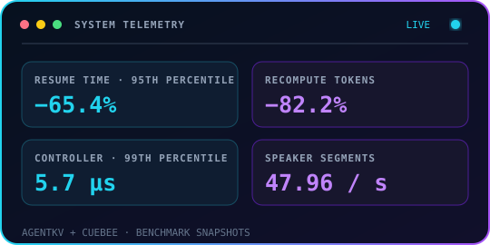
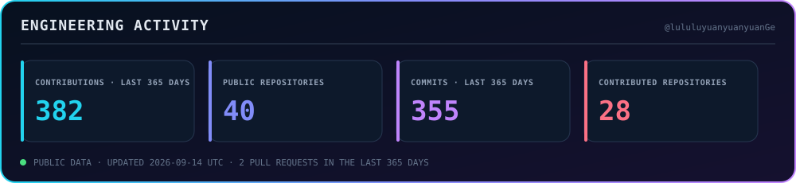

  

### Building the systems behind intelligent products

- 🔭 Building application-aware **Key-Value (KV) cache** runtimes for tool-using agents
- ⚡ Optimizing tail latency, recomputation, and **Graphics Processing Unit (GPU)** memory placement
- 🌱 Exploring **Artificial Intelligence (AI) infrastructure**, inference engines, and distributed execution
- 💬 Ask me about vLLM, PagedAttention, streaming inference, and stateful serving
- 🎓 Software Engineering at the University of Toronto

 

### Shipping CueBee

My personal iOS project: an artificial intelligence-powered
conversation copilot that delivers real-time cues through your earbuds.

  
  

### Systems toolkit

Languages and runtimes across NVIDIA Compute Unified Device Architecture (CUDA),
Open Neural Network Exchange (ONNX) Runtime, and cloud-native deployment.

  
  
  
  
  
  
  
  
  
  
  
  

### Selected systems

<table>
  <tr>
    <td width="50%" valign="top">
      <a href="https://github.com/lululuyuanyuanyuanGe/agentKV"><strong>AgentKV</strong></a> 
      Application-aware cache lifecycle control for agent workloads on vLLM V1. 
      KV cache · accelerator memory · safe offload
    </td>
    <td width="50%" valign="top">
      <a href="https://github.com/lululuyuanyuanyuanGe/cuebee-infra"><strong>CueBee Inference Infrastructure</strong></a> 
      Stateful streaming inference for long-lived, revisable conversations. 
      Prefix reuse · branch invalidation · stale-output gating
    </td>
  </tr>
  <tr>
    <td width="50%" valign="top">
      <a href="https://github.com/lululuyuanyuanyuanGe/cuebee-speaker-serving"><strong>CueBee Speaker Serving</strong></a> 
      Multi-tenant, real-time speaker diarization with cross-session micro-batching. 
      Audio inference · online clustering · stable identities
    </td>
    <td width="50%" valign="top">
      <a href="https://github.com/lululuyuanyuanyuanGe/UAIassist"><strong>UAIassist</strong></a> 
      Stateful agent workflow for spreadsheet and report generation. 
      LangGraph · schema mapping · human confirmation
    </td>
  </tr>
</table>

### Engineering activity

  

  Inference runtimes · distributed systems · infrastructure for long-lived intelligent workloads

