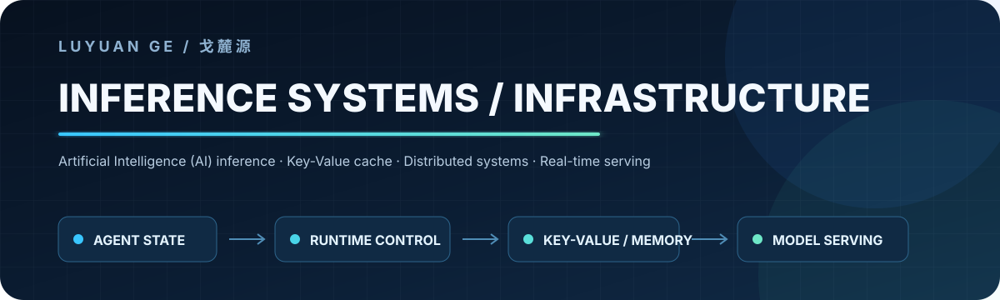

  <picture>
    <source media="(prefers-color-scheme: dark)" srcset="assets/profile-banner.svg">
    <source media="(prefers-color-scheme: light)" srcset="assets/profile-banner.svg">
    
  </picture>

  <strong>Software Engineering @ University of Toronto · Building reliable inference systems</strong>

I work on the systems layer behind intelligent products: inference runtimes, cache and
memory lifecycle, distributed execution, and low-latency streaming services. I care about
making stateful workloads correct under retries, revisions, resource pressure, and partial
failure—not just making a demo run once.

Currently, I am a Software Engineering Intern on TikTok Ads Infrastructure. Previously, I
worked on distributed Vision-Language-Action training systems at ShanghaiTech University
and agentic data workflows at China Unicom.

## Selected systems

<table>
  <tr>
    <td width="50%" valign="top">
      <h3><a href="https://github.com/lululuyuanyuanyuanGe/agentKV">AgentKV</a></h3>
      
<strong>Application-aware Key-Value cache lifecycle control for agent workloads on vLLM V1.</strong>

      
Connects session, branch, generation, and lifecycle state to safe cache retention,
      eviction, and offload decisions while preserving native fallback behavior.

      
<code>vLLM V1</code> · <code>Python</code> · <code>C++</code> · <code>accelerator memory</code>

    </td>
    <td width="50%" valign="top">
      <h3><a href="https://github.com/lululuyuanyuanyuanGe/cuebee-infra">CueBee Inference Infrastructure</a></h3>
      
<strong>Stateful streaming inference for long-lived, revisable conversations.</strong>

      
Maintains committed and tentative transcript state, reuses stable prefixes,
      invalidates affected branches, schedules background tasks, and gates stale output.

      
<code>Streaming inference</code> · <code>vLLM</code> · <code>Copy-on-Write</code>

    </td>
  </tr>
  <tr>
    <td width="50%" valign="top">
      <h3><a href="https://github.com/lululuyuanyuanyuanGe/cuebee-speaker-serving">CueBee Speaker Serving</a></h3>
      
<strong>Multi-tenant, real-time speaker diarization serving.</strong>

      
Combines Voice Activity Detection, log-Mel features, cross-session micro-batching,
      online centroid assignment, persistent speaker identities, and transcript alignment.

      
<code>Open Neural Network Exchange Runtime</code> · <code>Real-time audio</code> · <code>Micro-batching</code>

    </td>
    <td width="50%" valign="top">
      <h3><a href="https://github.com/lululuyuanyuanyuanGe/UAIassist">UAIassist</a></h3>
      
<strong>Stateful agent workflow for spreadsheet and report generation.</strong>

      
Routes document ingestion, source selection, schema mapping, multi-table processing,
      human confirmation, and structured report generation through a LangGraph workflow.

      
<code>LangGraph</code> · <code>Python</code> · <code>Structured data</code>

    </td>
  </tr>
</table>

## What I optimize for

- **Correctness under changing state** — versioned inputs, idempotency, ownership, and stale-work cancellation.
- **Predictable tail latency** — bounded control paths, batching, overload behavior, and explicit fallbacks.
- **Resource-aware execution** — cache reuse, memory pressure, heterogeneous placement, and distributed scaling.
- **Reproducible engineering** — runnable demos, tests, architecture contracts, and clearly scoped evidence.

## Technical focus

`C/C++` · `Python` · `Swift` · `Compute Unified Device Architecture (CUDA)` ·
`PyTorch Distributed` · `vLLM` · `Open Neural Network Exchange (ONNX) Runtime` ·
`NVIDIA Collective Communications Library (NCCL)` · `Linux` · `Docker` · `Kubernetes`

  Interested in inference engines, distributed systems, and infrastructure for long-lived intelligent workloads.

